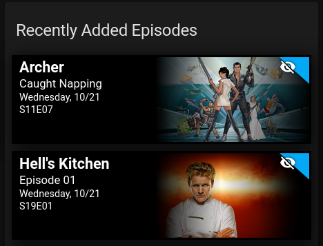
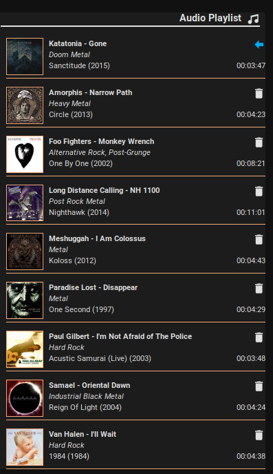

# Kodi Media Sensors for Home Assistant

[](https://github.com/jtbgroup/kodi-media-sensors)
[](https://github.com/hacs/integration)
[](LICENSE)
[](https://github.com/jtbgroup/kodi-media-sensors/actions)

This Home Assistant component is used to feed custom cards like [Upcoming Media Card](https://github.com/custom-cards/upcoming-media-card), [Kodi Playlist Card](https://github.com/jtbgroup/kodi-playlist-card) or [Kodi Search Card](https://github.com/jtbgroup/kodi-search-card) with data coming from Kodi. It is based on the project of Aaron Godfrey (https://github.com/boralyl/kodi-recently-added). Check the [credits section](#credits).

| Upcoming Media Card | Kodi playlist Card |
| ---- | ---- |
|  |  |

## Table of Contents

- [Kodi Medoa Sensors for Home Assistant](#kodi-media-sensors-for-home-assistant)
- [Table of Contents](#table-of-contents)
  - [Installation](#installation)
  - [Sensors](#sensors)
  - [Configuration](#configuration)
  - [Services](#services)
  - [Upgrading from configuration.yaml to UI Integration](#upgrading-from-configurationyaml-to-ui-integration)
  - [Known Issues](#known-issues)

## Installation

### Pre-Installation

**NOTE: This component has been tested with Home Assistant 2021.1.3 only. Additionally Kodi must be setup via the UI in the integrations section of the Home Assistant configuration.**

### HACS Install

1. Search for `Kodi Media Sensors` under `Integrations` in the HACS Store tab.
2. **You will need to restart after installation for the component to start working.**
3. Go to [Integration Installation](#integration_installation) your sensor using the options.

### Manual Install

**This method is not recommended**

1. In your `/config` directory, create a `custom_components` folder if one does not exist.
2. Copy the [kodi_media_sensors](https://github.com/jtbgroup/kodi-media-sensors/tree/master/custom_components) folder and all of it's contents from to your `custom_components` directory.
3. Restart Home Assistant.
4. Go to [Integration Installation](#integration-installation) your sensor using the options.

### Integration Installation

1. After Automatic install or manual install, go to the Integration panel (under Configuration section) and search for the ne component by clicking on the button 'Add Integration'. Enter the name of the component (Kodi Media Sensors).
2. During the installation, choose the Kodi entity previously installed.
3. Select the sensors you want to use (see [Available Sensors](#available-sensors))
4. Click Submit
5. You should now see new entities in Home Assistant (one for each sensor activated)

It's not possible to add new sensors after installation, so if you need new ones (or if you don't need one anymore), just uninstall the integration and add it again. You will then be able to select the sensors you need.

## Sensors

| Sensor name | Description |
| ---- | ---- |
| `sensor.kodi_media_sensor_recently_added_tvshow` | The sensor is contains information about the recently added tvshows in Kodi. The sensor updated by polling kodi on a regular base. |
| `sensor.kodi_media_sensor_recently_added_movie` | 
The sensor is contains information about the recently added movies in Kodi. The sensor updated by polling kodi on a regular base. |
| `sensor.kodi_media_sensor_playlist` | The sensor is contains information about the running playlist (audio and video) in Kodi. The sensor is updated using the events generated by the Kodi integration. |
| `sensor.kodi_media_sensor_search` | The sensor allows you to search for media content in the kodi libraries. The sensor has multiple configuration options so you can choose the media type you want to include in your search result. |

Some sensors come with services you can use. The definition of the services depends on each sensor. The service can be called via ***call_method***


## Configuration

### Configuring the Integrations

A `Configure` button will appear on the integration. Clicking this will allow you to
toggle additional options.

| Option | sensor | Description |
| ------ | ---- | ------- |
| hide_watched | _global_ | Excludes recently added video media that is marked as watched (movie sensors) when option is schecked |
| search_* | search | Those properties must be true if you want to include those item type in the search result (ex: search_songs, search_movies, ...) |
| search_*_limit | search | Sets the limit of the results returned by a search call for a specific item type (ex: search_songs_limit, search_movies_limit) |

## Services

### Sensor Playlist

1. ***goto(posn, player)***

    This function plays the object at the given position for the given player

Example:

``` yaml
entity_id: sensor.kodi_media_sensor_playlist
method: goto
item: 
  playerid: 0
  to: 5
```

2. ***remove(posn, player)***

    This function removes an object from the given playlist 

Example:

``` yaml
entity_id: sensor.kodi_media_sensor_playlist
method: remove
item:
  playlistid: 0
  position: 5
```

### Sensor Search

1. ***search(media_type, value)***

    Searches in the specified media type for the referenced value. The media type 'all' will return result for songs, albums, artists, movies and tv shows.
    - `media_type:` { all &#124; artist &#124; tvshow }
    - `value:` { str (title) &#124; int (artistid) &#124; int (tvshowid) }

Example:

``` yaml
entity_id: sensor.kodi_media_sensor_search
method: search
item:
  media_type: all
  value: beatles
```

2. ***clear()***

    This function clears the data of the sensor

Example:

``` yaml
entity_id: sensor.kodi_media_sensor_search
method: clear
```

3. ***play(arg)***

    This function plays the desired object wth the good player. The argument depends on what object has to be played. the argument can be one of songid, albumid, movieid, episodeid.

Examples:

``` yaml
entity_id: sensor.kodi_media_sensor_search
method: play
songid: 1
```

``` yaml
entity_id: sensor.kodi_media_sensor_search
method: play
movieid: 15
```

4. ***reset_addons()***

  This method resets the presence (and active status) of the addons. This is to call for example if you activate a PVR client addon and you want to include the search results of the channels in your resultset.
  ... another option would be to reboot HA!

Example:

``` yaml
service: kodi_media_sensors.call_method
data:
  entity_id: sensor.kodi_media_sensor_search
  method: reset_addons
  ```

### Cards to use with sensors

The goal is to group all the sensors and have seperate Cards to display the sensors data. The cards that where tested are:

- [Upcoming Media Card](https://github.com/custom-cards/upcoming-media-card) (kodi_media_sensor_recently_added_tvshow or kodi_media_sensor_recently_added_movie)
- [Kodi Playlist Card](https://github.com/jtbgroup/kodi-playlist-card) (kodi_media_sensor_playlist)
- [Kodi Search Card](https://github.com/jtbgroup/kodi-search-card) (kodi_media_sensor_search)

**Samples** for ui-lovelace.yaml

Depending on the sensors you added and the custom card you installed, you can use the code below to display information from Kodi.

Here two examples with [Upcoming Media Card](https://github.com/custom-cards/upcoming-media-card) and [Kodi Playlist Card](https://github.com/jtbgroup/kodi-playlist-card)

``` yaml
- type: custom:upcoming-media-card
  entity: sensor.kodi_recently_added_tv
  title: Recently Added Episodes
  image_style: fanart
```

``` yaml
- type: custom:kodi-playlist-card
  entity: sensor.kodi_media_sensor_playlist
```

## Upgrading from configuration.yaml to UI Integration

1. Remove any sensors in your `configuration.yaml` that reference the `kodi_media_sensors`
   platform.
2. Restart Home Assistant.
3. Follow the steps from the begining in the section [Installation](#installation)

## Known Issues

Below is a list of known issues that either can't be fixed by changes to the component
itself due to external factors.

### Artwork does not load

One reason this could occur is if you setup you Home Assistance instance to use SSL and
your Kodi instance does not use SSL. When the upcoming-media-card tries to load the
artwork it will fail to do so since modern browsers do not allow loading insecure requests.
See [#6](https://github.com/boralyl/kodi-recently-added/issues/6) for more details and
possible workarounds.

### Genres, ratings and studios don't show up for TV Shows

Currently genres, rating, and studio are only populated for Movies. This is a limitation
of the data Kodi stores for TV shows.

## Credits

[Aaron Godfrey](https://github.com/boralyl) is the original developer of this project and did an excellent job. As I needed something similar to display my running playlist in Kodi, I started to enhance the component.
Thanks a lot Aaron for letting me enhance your project! Let's hope other people might find it useful.
Do not hesitate to support Aaron and his many projects.
